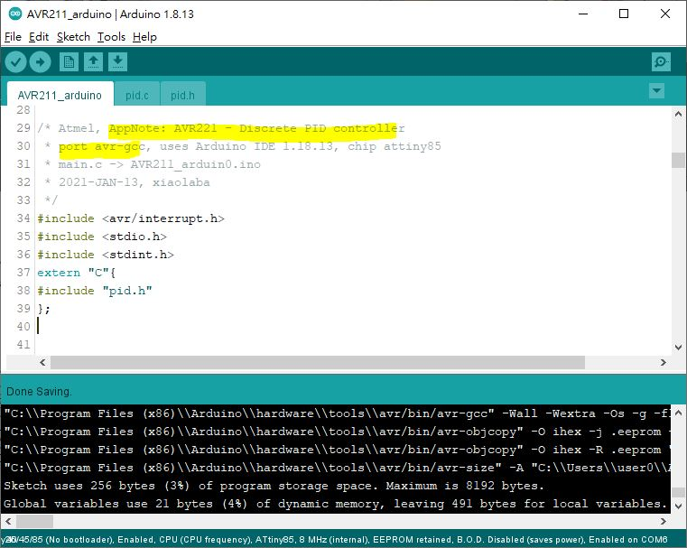

# build the controller with MCU  
### ref : this is Atmel's, now Microchip. PID application note,
download AN2558 and the AVR211 code https://www.microchip.com/wwwAppNotes/AppNotes.aspx?appnote=en591227
it was used with IAR compiler.

### ref: port to avr-gcc, uses Arduino IDE, chip attiny85, ok  
source code [AVR211_arduino](AVR211_arduino)  

result  

