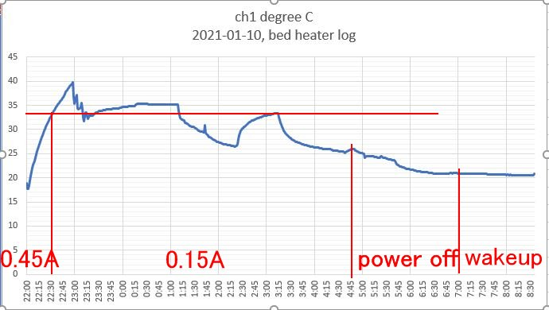
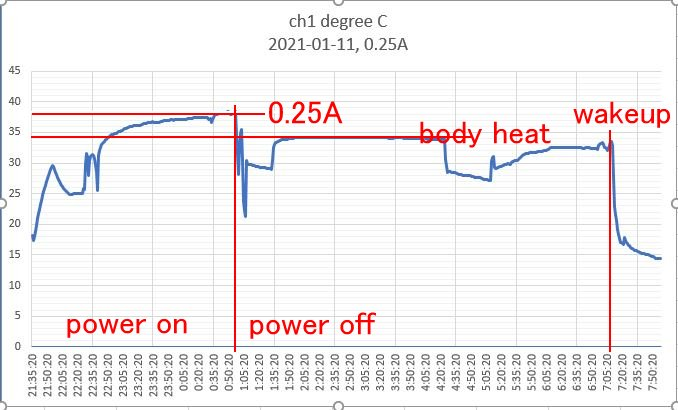
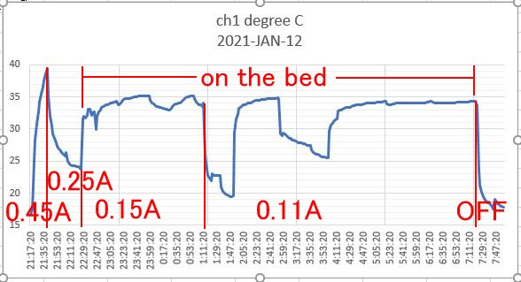
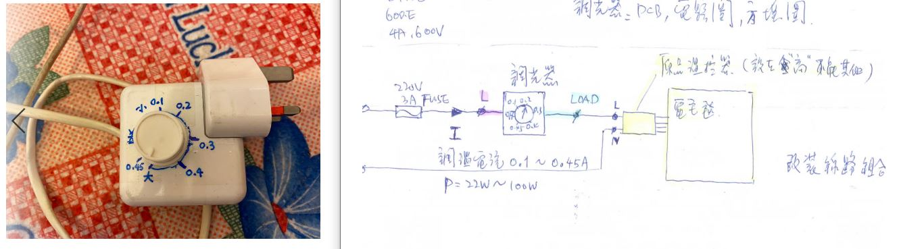
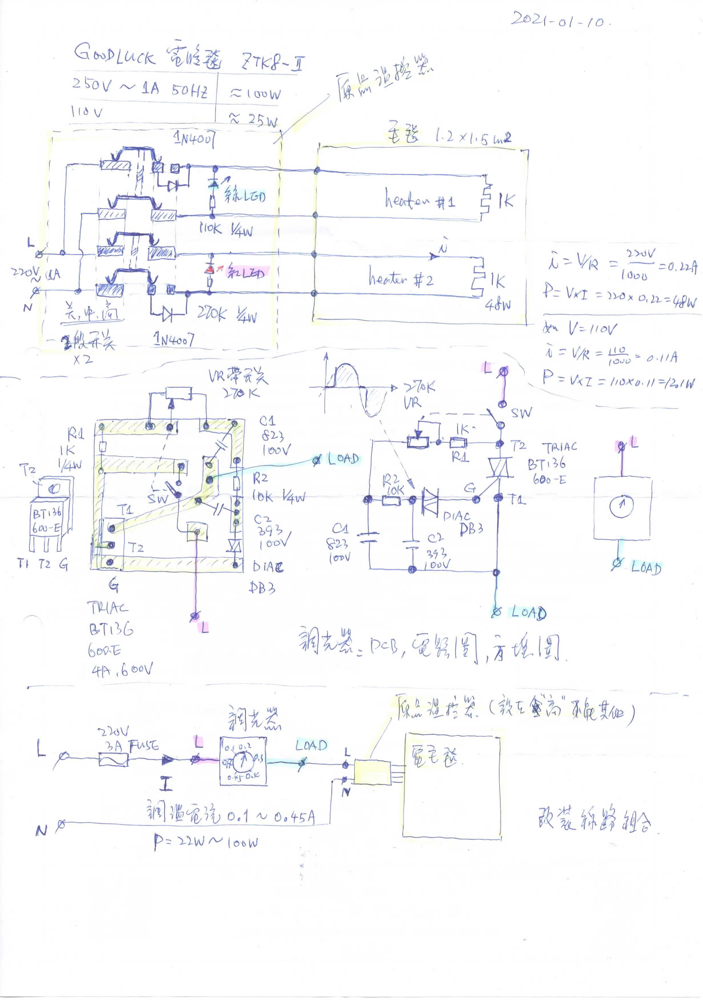

# light-dimmer-electric-blanket
light dimmer for 220V 100W electric blanket, TRIAC BT136-600E, design experiment for temperature controller

## average current control only
light dimmer and heater current adjustment only, open loop system

  

  

  

### hardware

